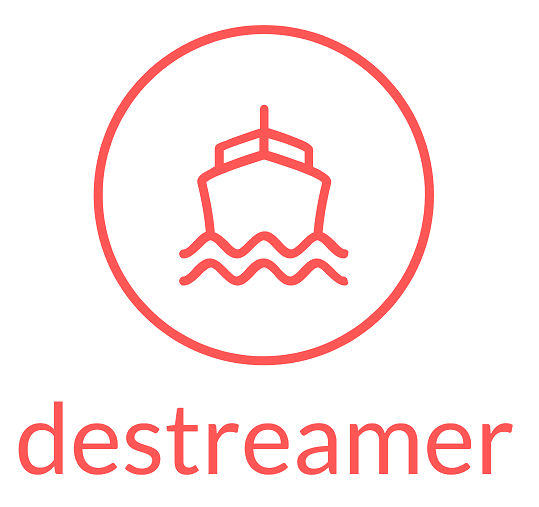

<a href="https://github.com/snobu/destreamer/actions">
  
</a>



## Saves Microsoft Stream videos for offline enjoyment

## v2.0 Release, codename _Hammer of Dawn<sup>TM</sup>_

This release would not have been possible without the code and time contributed by two distinguished developers: [@lukaarma](https://github.com/lukaarma) and [@kylon](https://github.com/kylon). Thank you!

## What's new

- We now have a token cache so we can reuse access tokens. This really means that within one hour you need to perform the interactive browser login only once.
- We removed the dependency on `youtube-dl`.
- Getting to the HLS URL is dramatically more reliable as we dropped parsing the DOM for the video element in favor of calling the Microsoft Stream API
- Fixed access token lifetime bugs (you no longer get a 403 Forbidden midway though your download list)
- Fixed a wide variety of other bugs, maybe introduced a few new ones :)

## Disclaimer

Hopefully this doesn't break the end user agreement for Microsoft Stream. Since we're simply saving the HLS stream to disk as if we were a browser, this does not abuse the streaming endpoints. However i take no responsibility if either Microsoft or your Office 365 admins request a chat with you in a small white room.

## Prereqs

- **Node.js**: anything above v8.0 seems to work. A GitHub Action runs tests on all major Node versions on every commit.
- **npm**: Usually comes with Node.js, type `npm` in your terminal to check for its presence
- **ffmpeg**: a recent version (year 2019 or above), in `$PATH` or in the same directory as this README file (project root).

Destreamer takes a [honeybadger](https://www.youtube.com/watch?v=4r7wHMg5Yjg) approach towards the OS it's running on. We've successfully tested it on Windows, macOS and Linux.

## How to build

To build destreamer run the following commands, in order -
- `npm install`
- `npm run -s build`

## Usage

```
$ ./destreamer.sh

Options:
  --help                   Show help                                   [boolean]
  --version                Show version number                         [boolean]
  --videoUrls, -i          List of video urls                            [array]
  --videoUrlsFile, -f      Path to txt file containing the urls         [string]
  --username, -u                                                        [string]
  --outputDirectory, -o    The directory where destreamer will save your
                           downloads [default: videos]                  [string]
  --outputDirectories, -O  Path to a txt file containing one output directory
                           per video                                    [string]
  --noExperiments, -x      Do not attempt to render video thumbnails in the
                           console                    [boolean] [default: false]
  --simulate, -s           Disable video download and print metadata information
                           to the console             [boolean] [default: false]
  --verbose, -v            Print additional information to the console (use this
                           before opening an issue on GitHub)
                                                      [boolean] [default: false]
```

Make sure you use the right script (`.sh`, `.ps1` or `.cmd`) and escape char (if using line breaks) for your shell.
PowerShell uses a backtick [ **`** ] and cmd.exe uses a caret [ **^** ].

Download a video -
```sh
$ ./destreamer.sh -i "https://web.microsoftstream.com/video/VIDEO-1"
```

Download a video to a custom path -
```sh
$ ./destreamer.sh -i "https://web.microsoftstream.com/video/VIDEO-1" -o /Users/hacker/Downloads
```

Download two or more videos -
```sh
$ ./destreamer.sh -i "https://web.microsoftstream.com/video/VIDEO-1" \
                     "https://web.microsoftstream.com/video/VIDEO-2"
```

Download many videos but read URLs from a file -
```sh
$ ./destreame.sh -f list.txt
```

You can create a `.txt` file containing your video URLs, one video per line. The text file can have any name, followed by the `.txt` extension.

Passing `--username` is optional. It's there to make logging in faster (the username field will be populated automatically on the login form).

You can use an absolute path for `-o` (output directory), for example `/mnt/videos`.

## Expected output


By default, downloads are saved under `videos/` unless specified by `-o` (output directory).

## Found a bug?

Please open an [issue](https://github.com/snobu/destreamer/issues) and we'll look into it.